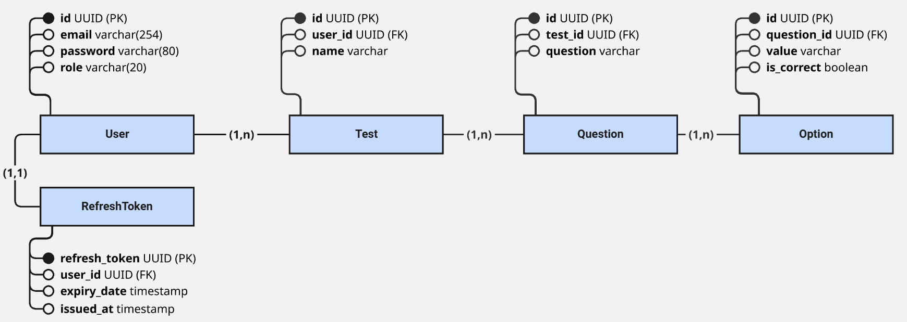

<div id="user-content-toc">
  <ul align="center" style="list-style: none;">
    <summary>
      <h1>SISTEMA DE PROVAS</h1>
    </summary>
  </ul>
</div>

Esse sistema foi pensado para o usuário criar sua própria prova ou fazer a de outro usuário.



<picture>
  <source media="(prefers-color-scheme: dark)" srcset="https://raw.githubusercontent.com/oDroca/icones-para-readme/main/assets/stack-white.svg" height="40">
  
</picture>

<br>

<picture>
  <source media="(prefers-color-scheme: dark)" srcset="https://raw.githubusercontent.com/oDroca/icones-para-readme/main/icons/java-white.svg" width="50">
  
</picture>
&nbsp; &nbsp; &nbsp; &nbsp; &nbsp;
<picture>
  <source media="(prefers-color-scheme: dark)" srcset="https://cdn.simpleicons.org/spring/white" width="50">
  
</picture>
&nbsp; &nbsp; &nbsp; &nbsp; &nbsp; &nbsp; &nbsp; &nbsp; 
<picture>
  <source media="(prefers-color-scheme: dark)" srcset="https://cdn.simpleicons.org/apachemaven/white" width="50">
  
</picture>
&nbsp; &nbsp; &nbsp; &nbsp; &nbsp; &nbsp;
<picture>
  <source media="(prefers-color-scheme: dark)" srcset="https://cdn.simpleicons.org/postgresql/white" width="50">
  
</picture>

<b>Java 17 &nbsp; &nbsp;&nbsp;
<b>Spring 3.5.5&nbsp; &nbsp; &nbsp; &nbsp;
<b>Maven 4.0.0&nbsp; &nbsp; &nbsp; &nbsp;
<b>PostgreSQL


<picture>
  <source media="(prefers-color-scheme: dark)" srcset="https://raw.githubusercontent.com/oDroca/icones-para-readme/main/assets/como-instalar-white.svg" height="40">
  
</picture>

<br>

<picture>
  <source media="(prefers-color-scheme: dark)" srcset="https://raw.githubusercontent.com/oDroca/icones-para-readme/main/assets/rotas-white.svg" height="40">
  
</picture>

> **Nota:** *Para essas rotas funcionarem, é necessário enviar o Access Token via Cookie HttpOnly*

<details>
    <summary><strong> Provas </strong> <sub> (expandir) </sub></summary>

* #### POST /auth
  * #### Como criar uma conta `/auth/signup`
    <details>
        <summary><strong> Exemplo de requisição 📤 </strong> <sub> (expandir) </sub></summary>
        &nbsp;

      ```json
      {
        "email": "example@example.com",
        "password": "123!123a"
      }
      ```

    </details>

    <details>
        <summary><strong> Exemplo de resposta 📥 </strong> <sub> (expandir) </sub></summary>
        &nbsp;

      ```json
      {
        "message": "Conta criada com sucesso!"
      }
      ```

    </details>

  * #### Como criar uma conta `/auth/login`
    <details>
        <summary><strong> Exemplo de requisição 📤 </strong> <sub> (expandir) </sub></summary>
        &nbsp;

      ```json
      {
        "email": "example@example.com",
        "password": "123!123a"
      }
      ```

    </details>

    <details>
        <summary><strong> Exemplo de resposta 📥 </strong> <sub> (expandir) </sub></summary>
        &nbsp;

      ```json
      {
        "userId": "9fa7c520-38d9-453c-957f-6b0f0cc8a293"
      }
      ```

    </details>

  * #### Como criar uma conta `/auth/refresh`
    Recebe o Refresh Token via Cookie HttpOnly e responde um com Access Token e Refresh Token, inválidando assim o Refresh Token antigo.


</details>

<details>
    <summary><strong> Provas </strong> <sub> (expandir) </sub></summary>


* #### POST /test
  * #### Como criar uma prova `/test/`
    <details>
      <summary><strong> Exemplo de requisição 📤 </strong> <sub> (expandir) </sub></summary>
      &nbsp;

    ```json
    {
        "name": "Prova de teste 01"
    }
    ```
    </details>

    <details>
      <summary><strong> Examplo de resposta 📥 </strong> <sub> (expandir) </sub></summary>
    &nbsp;

    ``` json
    {
        "testId": "5e6863bc-4f69-4a95-b672-c41296ec95a2",
        "name": "Prova de teste 01",
        "totalQuestions": 5
    }
    ```
    </details>

  * #### Como responder uma prova `/test/{testId}`
    <details>
      <summary><strong> Exemplo de requisição 📤 </strong> <sub> (expandir) </sub></summary>
      &nbsp;

    ```json
    {
      "questions": [
        {
          "questionId": "9fa7c520-38d9-453c-957f-6b0f0cc8a293",
          "selectedOptionId": "de823a13-3c12-4cf7-b266-3d16abe98c94"
        }
      ]
    }
    ```
    </details>

    <details>
      <summary><strong> Examplo de resposta 📥 </strong> <sub> (expandir) </sub></summary>
      &nbsp;

    ``` json
    {
      "questions": [
        {
          "questionId": "9fa7c520-38d9-453c-957f-6b0f0cc8a293",
          "selectedOptionId": "de823a13-3c12-4cf7-b266-3d16abe98c94",
          "correctOptionId": "de823a13-3c12-4cf7-b266-3d16abe98c94",
          "isCorrect": true
        }
      ],
      "message": "Prova finalizada.",
      "correctCount": 1,
      "incorrectCount": 0
    }
    ```
    </details>

* #### GET /test

  * #### Retorna todas as provas do usuário `/test/`

    <details>
        <summary><strong> Examplo de resposta 📥 </strong> <sub> (expandir) </sub></summary>
    &nbsp;

    ``` json
    [
      {
        "testId": "07469299-616f-4f0a-8d09-12da01570437",
        "name": "Prova de Teste 1",
        "totalQuestions": 1
      }
    ]
    ```
    </details>
  
  * #### Retorna uma prova `/test/${testId}`

    <details>
      <summary><strong> Examplo de resposta 📥 </strong> <sub> (expandir) </sub></summary>
    &nbsp;
    
    ``` json
    {
      "testName": "Prova de Teste 1",
      "questions": [
        {
          "id": "9fa7c520-38d9-453c-957f-6b0f0cc8a293",
          "question": "Questão número 6",
          "options": [
            {
              "id": "1f8a0fd2-1992-49bc-b2d9-be97609b653c",
              "value": "1",
              "isCorrect": false
            },
            {
              "id": "e84e89bf-cb4d-4de0-95ce-2c4ea9e555b8",
              "value": "2",
              "isCorrect": false
            },
            {
              "id": "b9fdc438-6fbb-4165-ae29-c38b30087110",
              "value": "3",
              "isCorrect": false
            },
            {
              "id": "bdd3c697-94da-4032-a7c1-deef3eb9f14b",
              "value": "4",
              "isCorrect": false
            },
            {
              "id": "de823a13-3c12-4cf7-b266-3d16abe98c94",
              "value": "5",
              "isCorrect": true
            }
          ]
        }
      ]
    }
    ```
    </details>

* #### DELETE /test
    
    - #### Deleta uma prova `/test/${testId}`

      <details>
        <summary><strong> Examplo de resposta 📥 </strong> <sub> (expandir) </sub></summary>
      &nbsp;

      ``` json
      {
        "id": "dae17f4c-3b63-4ce6-92eb-7ce4c950b496",
        "message": "Prova deletada com sucesso!"
      }
      ```
      </details>

</details>

<details>
    <summary><strong> Questões </strong> <sub> (expandir) </sub></summary>

* #### POST /question

    - #### Como criar uma questão `/question/{testId}`

      <details>
        <summary><strong> Examplo de requisição 📤 </strong> <sub> (expandir) </sub></summary>
      &nbsp;

      ```json
      {
        "question": {
          "question": "Quanto é 1+1?",
          "options": [
            {"value": "1", "isCorrect": false},
            {"value": "2", "isCorrect": true},
            {"value": "3", "isCorrect": false},
            {"value": "4", "isCorrect": false}
          ]
        }
      }
      ```
      
      </details>

      <details>
        <summary><strong> Examplo de resposta 📥 </strong> <sub> (expandir) </sub></summary>
      &nbsp;

      ```json
      {
        "id": "486fce7b-2012-4a88-b23b-5cc353060643",
        "question": "Quanto é 1+1?",
        "totalOptions": 4,
        "correctOptionId": "d8bebc0f-16f2-4fb3-840f-5b106f0a78d8",
        "message": "Questão criada com sucesso!"
      }
      ```
      
      </details>

    - #### Como criar varias questões `/question/{testId}/batch`

      <details>
        <summary><strong> Examplo de requisição 📤 </strong> <sub> (expandir) </sub></summary>
      &nbsp;

      ```json
      {
        "questions": [
            {
              "question": "Quanto é 1+1?",
              "options": [
                {"value": "1", "isCorrect": false},
                {"value": "2", "isCorrect": true},
                {"value": "3", "isCorrect": false},
                {"value": "4", "isCorrect": false}
              ]
            },
            {
              "question": "Quanto é 1+2?",
              "options": [
                {"value": "1", "isCorrect": false},
                {"value": "2", "isCorrect": false},
                {"value": "3", "isCorrect": true},
                {"value": "4", "isCorrect": false}
              ]
            },
            {
              "question": "Quanto é 1+3?",
              "options": [
                {"value": "1", "isCorrect": false},
                {"value": "2", "isCorrect": false},
                {"value": "3", "isCorrect": false},
                {"value": "4", "isCorrect": true}
              ]
            }
        ]
      }
      ```
      
      </details>

* #### PUT /question
    - #### Como editar uma questão `/question/{testId}`

      <details>
        <summary><strong> Examplo de requisição 📤 </strong> <sub> (expandir) </sub></summary>
      &nbsp;

      ```json
      {
        "question": "Quanto é 10+10?",
        "options": [
          {"value": "100", "isCorrect": false},
          {"value": "20", "isCorrect": true},
          {"value": "200", "isCorrect": false},
          {"value": "10", "isCorrect": false}
        ]
      }
      ```

      </details>
      
      <details>
        <summary><strong> Examplo de resposta 📥 </strong> <sub> (expandir) </sub></summary>
      &nbsp;

      ```json
      {
        "questionId": "486fce7b-2012-4a88-b23b-5cc353060643",
        "message": "Questão alterada com sucesso!"
      }
      ```
      
      </details>

* #### GET /question
    - #### Retorna todas as questões de uma prova `/question/{testId}`
      
      <details>
        <summary><strong> Examplo de resposta 📥 </strong> <sub> (expandir) </sub></summary>
      &nbsp;

      ```json
      [
        {
          "id": "9fa7c520-38d9-453c-957f-6b0f0cc8a293",
          "question": "Questão número 6",
          "options": [
            {
              "id": "1f8a0fd2-1992-49bc-b2d9-be97609b653c",
              "value": "1",
              "isCorrect": false
            },
            {
              "id": "e84e89bf-cb4d-4de0-95ce-2c4ea9e555b8",
              "value": "2",
              "isCorrect": false
            },
            {
              "id": "b9fdc438-6fbb-4165-ae29-c38b30087110",
              "value": "3",
              "isCorrect": false
            },
            {
              "id": "bdd3c697-94da-4032-a7c1-deef3eb9f14b",
              "value": "4",
              "isCorrect": false
            },
            {
              "id": "de823a13-3c12-4cf7-b266-3d16abe98c94",
              "value": "5",
              "isCorrect": true
            }
          ]
        },
        {
          "id": "44d02fe8-3388-485a-95ca-a16703d25585",
          "question": "Quanto é 1+1?",
          "options": [
            {
              "id": "f9f9711f-86a2-47a2-b7e3-f149f449bead",
              "value": "1",
              "isCorrect": false
            },
            {
              "id": "ef6ba040-7354-4d6d-a566-489a41bfaf97",
              "value": "2",
              "isCorrect": true
            },
            {
              "id": "f24b21c2-7c3a-4f1b-8a75-47d6696882d1",
              "value": "3",
              "isCorrect": false
            },
            {
              "id": "b2d489e2-66fd-413a-b451-b8f7631d9b1a",
              "value": "4",
              "isCorrect": false
            }
          ]
        },
        {
          "id": "eb0a987f-dd0a-47cc-a912-0d54e79881bf",
          "question": "Quanto é 1+2?",
          "options": [
            {
              "id": "64d1e3ad-917f-42fd-94fa-47ec3da5ad44",
              "value": "1",
              "isCorrect": false
            },
            {
              "id": "651ff639-27af-4295-888d-3be53dbf7b06",
              "value": "2",
              "isCorrect": false
            },
            {
              "id": "763c1673-79ac-4d45-a3a0-866b7cb24011",
              "value": "3",
              "isCorrect": true
            },
            {
              "id": "67f3e8e5-50ce-47f7-aa84-f2edf5daae2b",
              "value": "4",
              "isCorrect": false
            }
          ]
        },
        {
          "id": "1c380efd-ede0-4570-a8cf-ad91783b068e",
          "question": "Quanto é 1+3?",
          "options": [
            {
              "id": "88fcd2df-4a2d-4839-ae68-68f3fcbd69c5",
              "value": "1",
              "isCorrect": false
            },
            {
              "id": "b857b1de-84b8-4232-b125-60e4823afd3e",
              "value": "2",
              "isCorrect": false
            },
            {
              "id": "79c97807-d33a-4031-8bdc-7aace96824bd",
              "value": "3",
              "isCorrect": false
            },
            {
              "id": "fa7139a4-aa58-408c-9018-7d274aedd029",
              "value": "4",
              "isCorrect": true
            }
          ]
        },
        {
          "id": "486fce7b-2012-4a88-b23b-5cc353060643",
          "question": "Quanto é 10+10?",
          "options": [
            {
              "id": "5c96eba8-508c-4277-9c7a-974b1abac323",
              "value": "100",
              "isCorrect": false
            },
            {
              "id": "69a724ec-17f2-49b4-9898-255b40864b89",
              "value": "20",
              "isCorrect": true
            },
            {
              "id": "66df9e69-f667-4ee0-987f-9608a3c66c6a",
              "value": "200",
              "isCorrect": false
            },
            {
              "id": "7998dad5-ab11-4778-901b-e26f32561e69",
              "value": "10",
              "isCorrect": false
            }
          ]
        }
      ]
      ```
      
      </details>
      
    - #### Retorna todas as questões de uma prova `/question/{testId}`
      
      <details>
        <summary><strong> Examplo de resposta 📥 </strong> <sub> (expandir) </sub></summary>
      &nbsp;

      ```json
      [
        {
          "id": "9fa7c520-38d9-453c-957f-6b0f0cc8a293",
          "question": "Questão número 6",
          "options": [
            {
              "id": "1f8a0fd2-1992-49bc-b2d9-be97609b653c",
              "value": "1",
              "isCorrect": false
            },
            {
              "id": "e84e89bf-cb4d-4de0-95ce-2c4ea9e555b8",
              "value": "2",
              "isCorrect": false
            },
            {
              "id": "b9fdc438-6fbb-4165-ae29-c38b30087110",
              "value": "3",
              "isCorrect": false
            },
            {
              "id": "bdd3c697-94da-4032-a7c1-deef3eb9f14b",
              "value": "4",
              "isCorrect": false
            },
            {
              "id": "de823a13-3c12-4cf7-b266-3d16abe98c94",
              "value": "5",
              "isCorrect": true
            }
          ]
        },
        {
          "id": "44d02fe8-3388-485a-95ca-a16703d25585",
          "question": "Quanto é 1+1?",
          "options": [
            {
              "id": "f9f9711f-86a2-47a2-b7e3-f149f449bead",
              "value": "1",
              "isCorrect": false
            },
            {
              "id": "ef6ba040-7354-4d6d-a566-489a41bfaf97",
              "value": "2",
              "isCorrect": true
            },
            {
              "id": "f24b21c2-7c3a-4f1b-8a75-47d6696882d1",
              "value": "3",
              "isCorrect": false
            },
            {
              "id": "b2d489e2-66fd-413a-b451-b8f7631d9b1a",
              "value": "4",
              "isCorrect": false
            }
          ]
        },
        {
          "id": "eb0a987f-dd0a-47cc-a912-0d54e79881bf",
          "question": "Quanto é 1+2?",
          "options": [
            {
              "id": "64d1e3ad-917f-42fd-94fa-47ec3da5ad44",
              "value": "1",
              "isCorrect": false
            },
            {
              "id": "651ff639-27af-4295-888d-3be53dbf7b06",
              "value": "2",
              "isCorrect": false
            },
            {
              "id": "763c1673-79ac-4d45-a3a0-866b7cb24011",
              "value": "3",
              "isCorrect": true
            },
            {
              "id": "67f3e8e5-50ce-47f7-aa84-f2edf5daae2b",
              "value": "4",
              "isCorrect": false
            }
          ]
        },
        {
          "id": "1c380efd-ede0-4570-a8cf-ad91783b068e",
          "question": "Quanto é 1+3?",
          "options": [
            {
              "id": "88fcd2df-4a2d-4839-ae68-68f3fcbd69c5",
              "value": "1",
              "isCorrect": false
            },
            {
              "id": "b857b1de-84b8-4232-b125-60e4823afd3e",
              "value": "2",
              "isCorrect": false
            },
            {
              "id": "79c97807-d33a-4031-8bdc-7aace96824bd",
              "value": "3",
              "isCorrect": false
            },
            {
              "id": "fa7139a4-aa58-408c-9018-7d274aedd029",
              "value": "4",
              "isCorrect": true
            }
          ]
        },
        {
          "id": "486fce7b-2012-4a88-b23b-5cc353060643",
          "question": "Quanto é 10+10?",
          "options": [
            {
              "id": "5c96eba8-508c-4277-9c7a-974b1abac323",
              "value": "100",
              "isCorrect": false
            },
            {
              "id": "69a724ec-17f2-49b4-9898-255b40864b89",
              "value": "20",
              "isCorrect": true
            },
            {
              "id": "66df9e69-f667-4ee0-987f-9608a3c66c6a",
              "value": "200",
              "isCorrect": false
            },
            {
              "id": "7998dad5-ab11-4778-901b-e26f32561e69",
              "value": "10",
              "isCorrect": false
            }
          ]
        }
      ]
      ```
      
      </details>

* #### DELETE /question
    - #### Deleta uma questão `/question/{questionId}`
      
      <details>
        <summary><strong> Examplo de resposta 📥 </strong> <sub> (expandir) </sub></summary>
      &nbsp;

      ```json
      {
        "id": "9fa7c520-38d9-453c-957f-6b0f0cc8a293",
        "message": "Questão deletada com sucesso!"
      }
      ```
      
      </details>

</details>

---


### Variáveis de Ambiente (.env)
<details>
  <summary><strong> Se necessário </strong> <sub> (expandir) </sub></summary>
&nbsp;

Para se conectar ao banco de dados sem expor a URL de conexão, eu tive que por essa configuraçãao para o projeto conseguir ler o arquivo ".env" em `.vscode/launch.json`.

```json
{
  "version": "0.2.0",
  "configurations": [
    {
      "type": "java",
      "name": "Spring Boot App",
      "request": "launch",
      "mainClass": "dev.odroca.api_provas.ApiProvasApplication",
      "projectName": "api_provas",
      "envFile": "${workspaceFolder}/.env"
    }
  ]
}
```

*O arquivo .env deve ficar na raiz do projeto para ser lido pelo launch.json e pelo docker — se estiver com PostgreSQL via docker.*

</details>

## Roadmap 🗺️
- [ ] Provas públicas e privadas